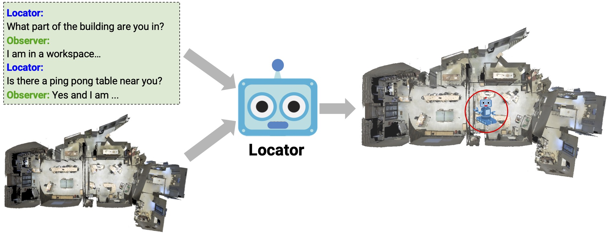

# Where Are You? (WAY) Localization from Embodied Dialog

This repository is the official implementation of [Where Are You? Localizaiton from Embodied Dialog]
https://arxiv.org/abs/2011.08277
[[project website](https://meerahahn.github.io/way/data)]

The Where Are You? (WAY) dataset contains ~6k dialogs in which two humans -- an Observer and a Locator -- complete a cooperative localization task. The Observer is spawned at random in a 3D environment and can navigate from first-person views while answering questions from the Locator. The Locator must localize the Observer in a map by asking questions and giving instructions. Based on this dataset, we define three challenging tasks: Localization from Embodied Dialog or LED (localizing the Observer from dialog history), Embodied Visual Dialog (modeling the Observer), and Cooperative Localization (modeling both agents).

This repository contains the implemenation of baseline models for the Localization from Embodied Dialog (LED) task. The main model we focus on is a LingUNet model with residual connections.

<p align="center">
  
</p>

## Setup

This project is developed with Python 3.6 and PyTorch

### Dependencies
Clone this repository and install the rest of the dependencies:

```bash
git clone git@github.com:batra-mlp-lab/WAY.git
cd WAY
python -m pip install -r requirements.txt
```


### Dataset Download
You will need to download the WAY dataset described [here (https://meerahahn.github.io/way/data)] into the data folder.

| Dataset | Extract path | Size |
|-------------- |---------------------------- |------- |
| [way_splits.zip](https://drive.google.com/file/d/1bMvfiiCetHNlPsVQq9M5lZlcz3K9cU2J/view) | `data/way_splits/` | 2 MB |
| [floorplans.zip](https://drive.google.com/file/d/1ocl14mlMQ4uOXTpII-gvrW7iThFdAX1h/view) | `data/floorplans/` | 103 MB |
| [word_embeddings.zip](https://drive.google.com/file/d/1Ne2vs2M4UJ3P4-bccYD1vHvLHXwrmMUh/view) | `data/word_embeddings/` | 13 MB |

Downloading the dataset:
```bash
python -m pip install gdown
cd data

# Word Embddings
gdown 'https://drive.google.com/uc?id=1Ne2vs2M4UJ3P4-bccYD1vHvLHXwrmMUh'
unzip word_embeddings.zip
rm word_embeddings.zip

# Floorplans
gdown 'https://drive.google.com/uc?id=1ocl14mlMQ4uOXTpII-gvrW7iThFdAX1h'
unzip floorplans.zip
rm floorplans.zip

# Floorplans
gdown 'https://drive.google.com/uc?id=1bMvfiiCetHNlPsVQq9M5lZlcz3K9cU2J'
unzip way_splits.zip
rm way_splits.zip
```

###  Pretrained Models
We provide a trained lingUnet-skip model described in the paper for the LED task. These models are hosted on Google Drive and can be downloaded as such:

```bash
python -m pip install gdown

# LingUNet-Skip (141MB)
gdown https://drive.google.com/uc?id=199hhL9M0yiurB3Hb_-DrpMRxWP1lSGX3
```
### Predictions
* In the paper we show accuracy on the LED task as defined by euclidean distance. Instead now we recommend using geodesic distance to calcuate Localization Error since this will be easier to evaluate across different different map representations. We have added code to snap our pixel prediction to a node in the scene graph and then calcuate the geodesic distance to the true location using the scene graph. We now evaluate accuracy at 0m, 5m, 10m and geodesic localization error.

* When submitting results to the evaluation server the format will:
`annotation_id, mesh_xyz_coor, viewpoint`

Results from LingUNet with geodesic distance and snap to scene graph:


### LingUNet-Skip Model
|Model | | |Val-Seen | | | Val-Unseen | Test |
| |LE|0m|5m| 10m| LE|0m|5m| 10m | LE|0m|5m| 10m |
|--------------------|--------------|----------------|-----------------|
| LingUNet-Skip         |  0.0           |  0.0             | 0.0   |
| Human Locator         |  0.0           |  0.0              | 0.0    |                                                                                                            


#### Usage
The `lingUnet/run.py` script is how training and evaluation is done for all model configurations.

For testing use `lingUnet/run_scripts/eval.sh` 
For training use `lingUnet/run_scripts/base.sh`  

Before running these scripts you will need to change the `BASEDIR`, `SAVEDIR`, `DATADIR` paths in both of the scripts.

Additionally use these files to change the parameters of the model which are set to default values in `lingUnet/cfg.py`

#### Evaluation
For evalutation you can run
`./lingUnet/run_scripts/eval.sh`
The model which to run will have to be set in the eval.sh file and as well as the `BASEDIR`, `SAVEDIR`, `DATADIR` paths. The file will evaluate the val splits and 


#### Ablation Parameters
Ablations Experiments and Parameters for Running the Model
* Language Changes
Argument language_change
Options:
shuffle
locator_only
observer_only
first_half
second_half
none 
 
* Removing Inputs 
blind_lang
blind_vis
data_aug

* Changing Architecture
No residual layer
All the rest should be easy to find and change in the cfg.py file

### Baseline Models
We presented 4 non-learning baselines in the paper, random pixel, random viewpoint, center pixel and a heuristic sliding window approach
* To run the heuristic sliding window approach go into `Baselines` run `python run_sliding_window.py`
* To run random and center baselines go into `Baselines` run `python paper_baselines.py`

## Contributing

If you find something wrong or have a question, feel free to open an issue. If you would like to contribute, please install pre-commit before making commits in a pull request:

```bash
python -m pip install pre-commit
pre-commit install
```

## Citing

If you use the WAY dataset in your research, please cite the following [paper](https://arxiv.org/abs/2011.08277):

```
@inproceedings{hahn2020you,
  title={Where Are You? Localization from Embodied Dialog},
  author={Hahn, Meera and Krantz, Jacob and Batra, Dhruv and Parikh, Devi and Rehg, James and Lee, Stefan and Anderson, Peter},
  booktitle={Proceedings of the 2020 Conference on Empirical Methods in Natural Language Processing (EMNLP)},
  pages={806--822},
  year={2020}
}
